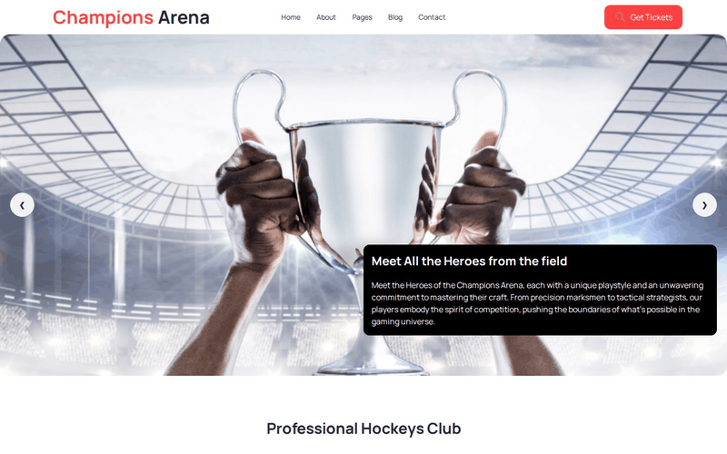
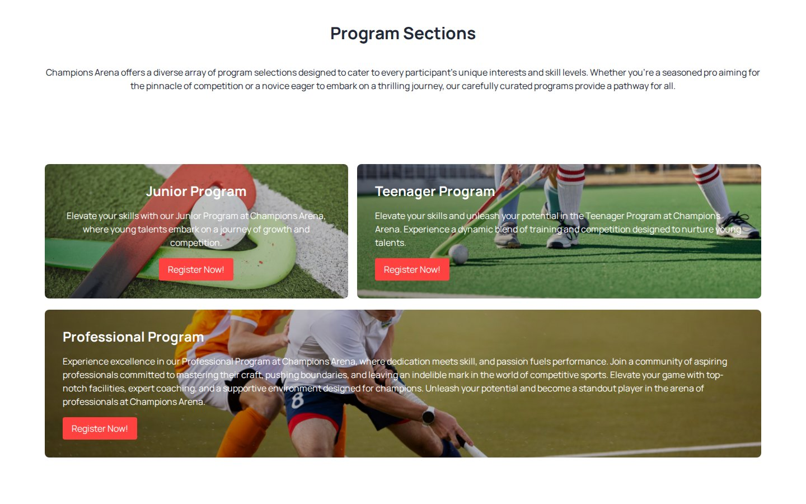
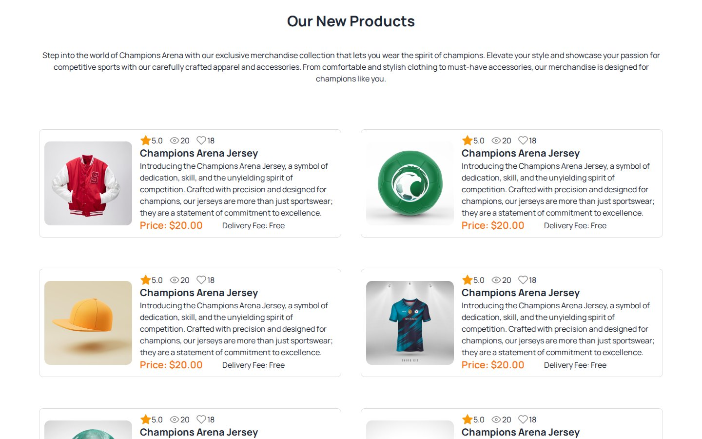
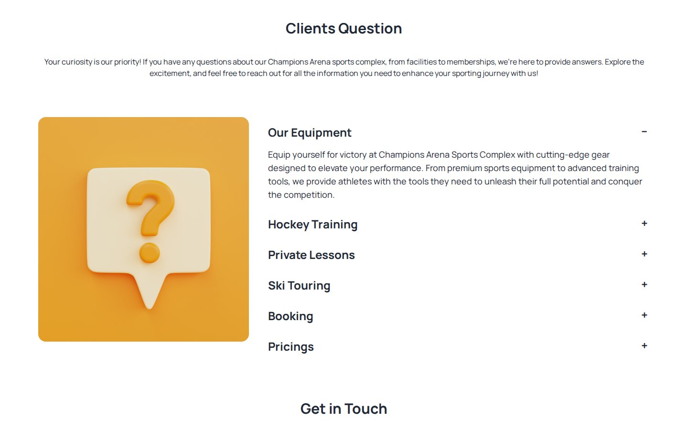
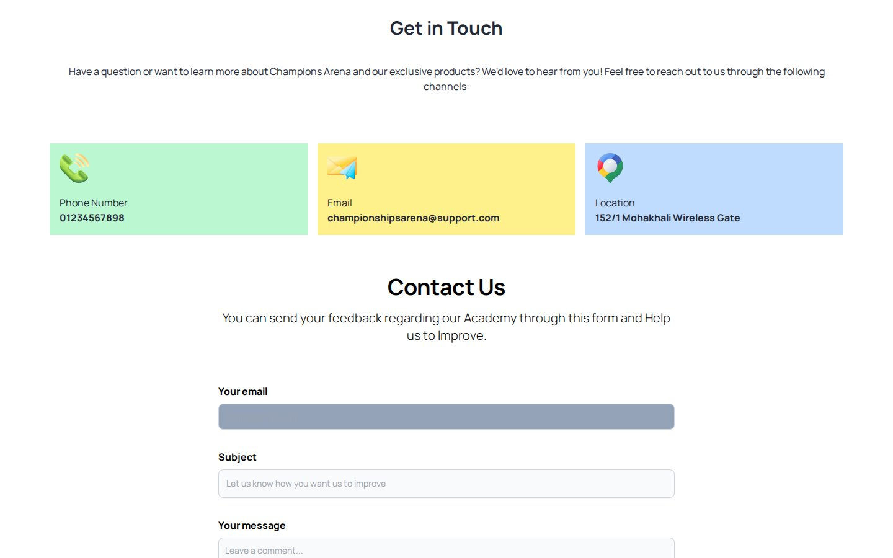

# Champions Arena

A responsive one-page website for a fictional hockey club and sports complex, built with Tailwind CSS and DaisyUI.

**Live site:** <https://shayan-abrar.github.io/Champions-Arena-Website/>

<p align="center">
  
</p>

<table>
  <tr>
    <td align="center" width="20%"><a href="screenshots/preview.jpg"></a><br><sub><b>Hero</b> · carousel</sub></td>
    <td align="center" width="20%"><a href="screenshots/programs.jpg"></a><br><sub><b>Programs</b></sub></td>
    <td align="center" width="20%"><a href="screenshots/products.jpg"></a><br><sub><b>Merchandise</b></sub></td>
    <td align="center" width="20%"><a href="screenshots/faq.jpg"></a><br><sub><b>FAQ</b> · accordion</sub></td>
    <td align="center" width="20%"><a href="screenshots/contact.jpg"></a><br><sub><b>Contact</b></sub></td>
  </tr>
</table>

A sports club's site has to introduce the club, sell its programs and merchandise, answer common questions and make it easy to get in touch, all on one scrolling page. This project builds each of those sections from DaisyUI components and Tailwind utility classes, so it's a practical reference for putting together a full landing page without writing custom JavaScript.

## Quick Start

```bash
git clone https://github.com/SHAYAN-ABRAR/Champions-Arena-Website.git
cd Champions-Arena-Website
python3 -m http.server 8000
```

Open <http://localhost:8000>. On Windows, use `python` instead of `python3`. Opening `index.html` directly in a browser works too. Tailwind CSS, DaisyUI and the Manrope font load from CDNs, so you need an internet connection.

## Features

- **Hero carousel:** two DaisyUI carousel slides with arrow controls and a caption card.
- **Club highlights:** four DaisyUI radial progress rings for player facilities, coaches, senior players and training grounds.
- **Program cards:** Junior, Teenager and Professional programs on photo backgrounds, each with a **Register Now!** button.
- **Merchandise grid:** six product cards with a photo, star rating, view and like counts, price and delivery fee.
- **FAQ accordion:** six DaisyUI collapse items (equipment, hockey training, private lessons, ski touring, booking and pricing), with one open at a time.
- **Contact section:** phone, email and location cards, plus a feedback form with email, subject and message fields.
- **Responsive layout:** Tailwind `sm:` and `lg:` breakpoints, and a DaisyUI dropdown menu for the navigation on small screens.

## Customizing

Most of the look comes from Tailwind classes in `index.html`. The club's red accent is set by two small classes in the `<style>` block at the top of the page. Change `#FF4240` in both to recolor the red "Champions" in the logo and the **Get Tickets** and **Register Now!** buttons:

```css
.btn-primary {
    color: #FF4240;
}

.btn-bg {
    background-color: #FF4240;
}
```

The progress rings take their fill from the `--value` custom property, for example `style="--value:70;"`.

## Limitations

This is a static front-end mockup. The navigation links, **Get Tickets** and **Register Now!** buttons don't go anywhere, and the contact form (`action="#"`) doesn't send messages. All six merchandise cards use the same "Champions Arena Jersey" title and description.

## Tech Stack

- HTML5
- Tailwind CSS (Play CDN) and DaisyUI 4.6.0 (carousel, radial progress, collapse, dropdown, buttons)
- Google Fonts: Manrope
- Hosted on GitHub Pages

## Contributing

Bug reports and suggestions are welcome. Please [open an issue](https://github.com/SHAYAN-ABRAR/Champions-Arena-Website/issues). Please read the license note below before reusing any code or images.

## License

This repository doesn't have a license yet, so it doesn't grant anyone permission to reuse or redistribute its code or images. Please ask before reusing any part of it.

---

Built by **Shayan Abrar** · [GitHub](https://github.com/SHAYAN-ABRAR) · [LinkedIn](https://www.linkedin.com/in/shayan-abrar/)
